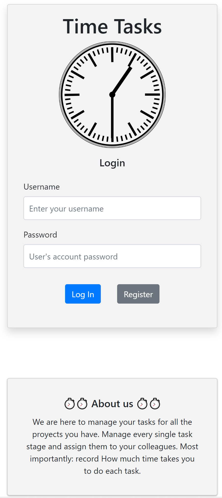
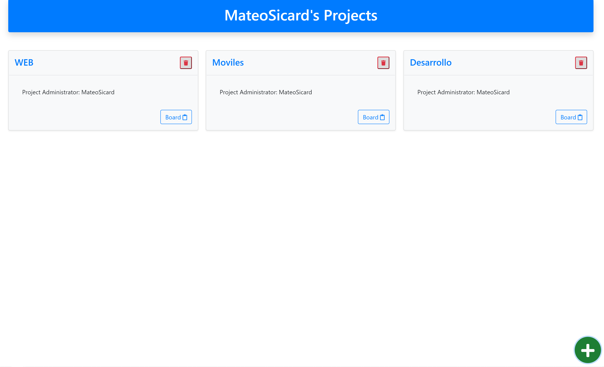
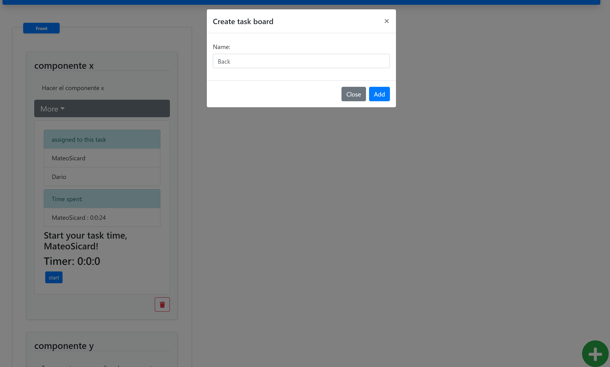
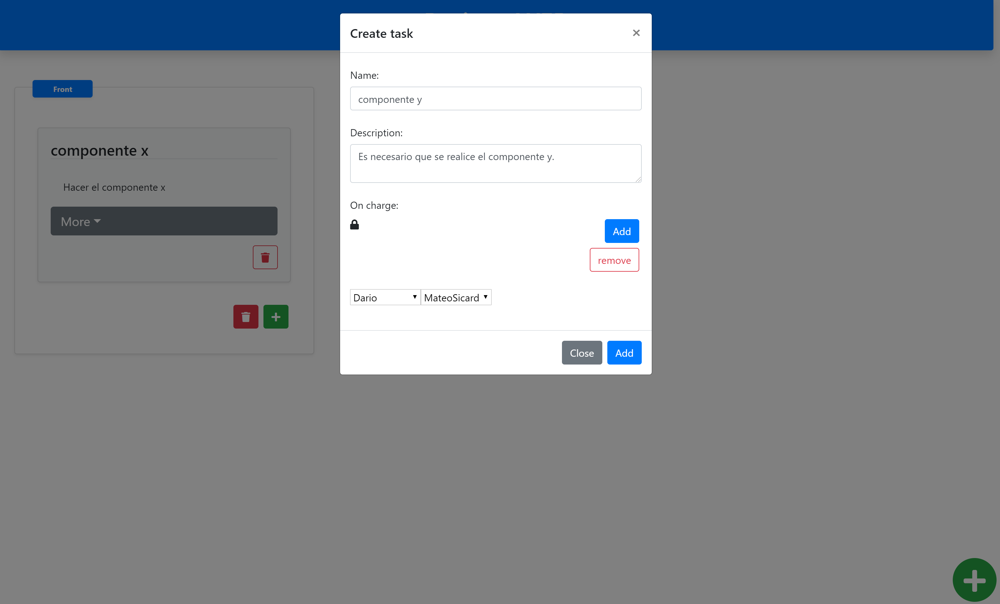
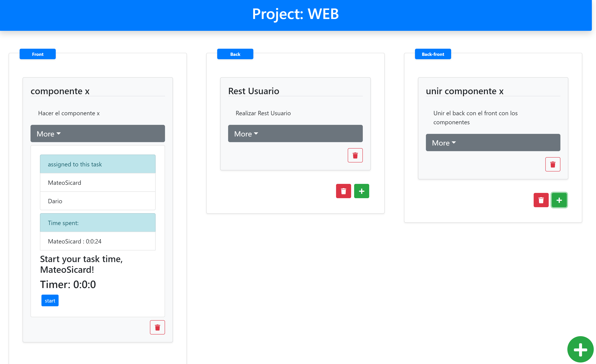
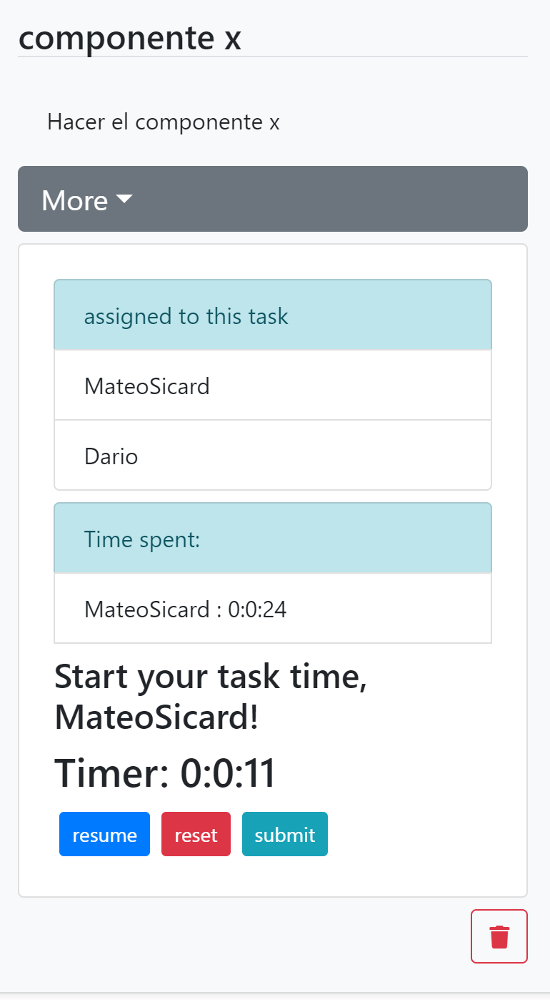

# Team02-Entrega2

# :timer_clock: TASK TIME RECORDER :timer_clock:

## (づ￣ 3￣)づ 🌵

## (* ￣3) ❤️ (ε￣ *)

## ⏰⏰⏰⏰⏱⏱⏱

------
## How To run

**What you should have installedon your pc before:**

* node
* nodemon (`npm install nodemon`)
* mongodb .
* (optional) mongo compass. 

**Instructions for the DB**

* you should have one DB called `MyTimeDB` and also two collections inside that DB called `users` and `proyects`.
* in the folder `/dumbDB` you'll find `toimport.txt` that has all the comands to import the `.json` that are in the folder. they are just a cuple of documents to make sure that the app works correctly.

**Instructions to run**

* clone the repository on your pc.
* open Terminal on `app-back` and run: `npm install`.
* run `npm start` to run the back-end
* open Terminal on `app-front` and run: `npm install` and `npm run build`.
* run `npm start` to run the front-end

------
## Video

(https://youtu.be/f10Hth4qtSE)

------

## Description

We are here to manage your tasks for all the proyects you have. Manage every single task stage and assign them to your colleagues. Most importantly: record How much time takes you to do each task.

* we have a login so you can register and share your proyect with your friends.

* also you can create and manage all your proyects!!

* in aproyect you can create a new taskboard an new tasks!!!

* You can manage your tasks!!!

* view the details of every task. You can record the time you spend on  a given task!!! 👌👌👌

------

## Licese

The person who associated a work with this deed has dedicated the work to the public domain by waiving all of his or her rights to the work worldwide under copyright law, including all related and neighboring rights, to the extent allowed by law.

You can copy, modify, distribute and perform the work, even for commercial purposes, all without asking permission. See Other Information below.

------
